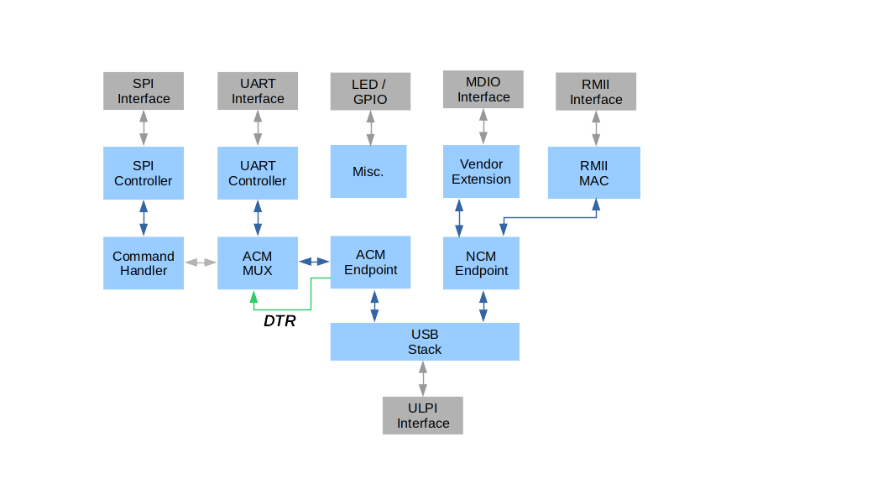
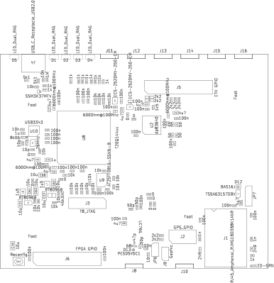

# Tic-Nic -- A PTP-Capable USB Ethernet Adapter with Hardware I/O

While there is certainly no lack of cheap USB-ethernet adapters
and most modern laptops and networking cards feature PTP-capable
network interfaces it is surprisingly difficult to find an affordable
product which provides access to hardware pins that can be used
to generate precisely synchronized events or capture PTP
timestamps.

This is the niche the tic-nic tries to fill. It is a very portable
USB gadget with a PTP PHY and clock providing a handfull of
GPIO pins that can be controlled in a synchronous fashion.

## Features

 - DP83640 PHY with several GPIO pins that are available to
   the user.
 - DP83640 is well supported by linux.
 - PTP in the PHY avoids uncertainty introduced by delays
   between PHY and MAC (most PTP-capable adapters implement
   it in the MAC).
 - Fully open-source project (hard-, firm- and software).
 - Low cost (PHY plus FPGA are in the order of $20).
   Uses an Efinix Trion T8 or T20 (recommended) device.
 - Remaining FPGA logic and pins available for user application.

## Block Diagram

## License

Tic-Nic is released under the [European-Union Public
License](https://joinup.ec.europa.eu/collection/eupl/eupl-text-eupl-12)
*with the exception of* the [ethernet driver](./software/driver/cdc_tic_nic.c)
which is released under a [dual GPL/BSD license](./software/driver/LICENSE).

The EUPL permits including/merging/distributing the licensed code with
products released under some other licenses, e.g., the GPL variants.

I'm also open to use a different license.

## Project Structure

The project consists of a kicad hardware design, FPGA
firmware written in VHDL and software.

### Hardware Design

The kicad design files are located in the `kicad` subdirectory.
Note that the project name (`trion-8-test.pro`) and some of
the sheet names are unfortunate and due to legacy reasons.

### Firmware

Firmware is located in the `firmware/` folder.

The top-level vhdl file along with the constraints
and tool-specific project files are located under `hdl/`
and `efx/`, respectively.

The heavy lifting is done by firmware libraries which
are attached as submodules under `firmware/modules`.

We find the `mecatica-usb` and `eth-rmii-mac` modules
which provide the usb device and endpoint implementation
and the ethernet MAC functionality.

The third module `acm-toolbox` is borrowed from another
project. It provides an ACM interface and some software
which allow accessing the configuration flash on the
board. It could also be used as a side-channel to peek/poke
at user FPGA resources.

#### Firmware Block Diagram

### Software

The most important software component is the linux driver
which builds on top of the vanilla `cdc_ncm` USB class
driver. Our driver adds functionality to access the PTP
PHY via vendor-specific USB requests. The driver also
establishes a link between the PHY and the ethernet
interface. With these bits in place the heavy machinery of
linux networking and PTP support can be leveraged without
further ado.

Some useful helper programs are not found in the `software`
directory but reside in the submodules.

## Building the Device

### Hardware

With some skill it is easy to assemble the hardware DYI. I have
my PCBs made at JLCPCB usually together with a stainless-steel
stencil (don't bother with cheaper materials).

I solder my designs in a toaster-oven; there is plenty of material
on the internet that show you how to do that.

For double-sided designs (like the tic-nic) I assemble the more
complex top layer first using normal solder paste. For the back-
side I employ lower-temperature paste to ensure the top-components
dont' fall off the flipped board when I heat the bottom but that
might be paranoid.

### Firmware

#### Install Efinity Software

To build the firmware you need to install the efinity software from
[efinix](https://www.efinixinc.com). At the time of this writing I'm
using version 2023.2.

The software is decent; the most serious draw-back is that it does not
support scripting and that their constraint language is quite limited when
compared with some of the big competitors.

Surprisingly, I found that inferral of RAMs and multipliers worked
out of the box (just FYI - there are no multipliers used in this
particular design)!

#### Generate Interface and Constraints

##### Introduction

Efinix - unlike any other manufacturer I have seen - use this odd
design where the FPGA core is embedded in a "ring" of peripheral
I/O cells and registers. None of the components residing in this
peripheral ring are part of the HDL design and the ring must be
configured separately. There is a special tool for this (the 'interface
designer') and unlike the main tool the interface designer luckily
*does* support scripting.

We make use of this feature because IMHO it is much easier to maintain
the peripheral design in git as scripts rather than the XML which is
generated by the interface designer.

The interface designer also can automatically generate *some* (but not
all) constraints, namely everything that connects *registers* in the
peripheral ring to the core logic. Other connections (which bypass registers)
must be constrained manually. Therefore, I tend to have at least two
constraint files

  1. Manually generated constraints (`<proj>.sdc`), maintained in git.
  2. Auto-generated constraints (`<proj>.pt.sdc`), generated via
     script by interface designer.

##### Prepare Design with `generate_project.py` Script

After a fresh git clone the interface files must be generated.
The `generate_project.py` script is provided to do that.

  1. Change directory to `firmware/efx`.
  2. Source the efinity setup

          source <efinity_install_dir>/bin/setup.sh

  3. Run the script

          python3 generate_project.py

  4. This should have generated the files

     - `firmware/efx/tic_nic.peri.xml`
     - `firmware/efx/tic_nic.pt.sdc`
     - `firmware/hdl/GitVersionPkg.vhd`

#### Synthesize the Design

After the interface has been generated you can start the efinity software
and using 'open project' you havigate to `firmware/efx/` and open `tic_nic.xml`.

Hit the 'synthesize' button and after a while you should find the bitstream
(`tic_nic.bit` and `tic_nic.hex.bin`) in the `firmware/efx/outflow/` folder.

The `.bit` file can be used with the efinity programmer software to configure
the FPGA via JTAG and the `tic_nic.hex.bin` can be used to re-program the
flash via USB using the firmware itself (see below).

#### Programming

In order to bootstrap the design you either need a JTAG programmer
(you can [build one yourself](https://github.com/till-s/trion-lqfp144-test) or
buy an [ftdi mini module](https://ftdichip.com/products/ft2232h-mini-module/);
the DYI version has the advantage that it can work with any voltage of the
JTAG bank; the mini-module, IIRC, requires additional level shifters if you
deviate from 3.3V) or a pre-programmed flash device.

### Software

#### Building the Linux Driver

Follow these steps after making sure you have all the necessary
packages installed that your distribution requires to build kernel
modules (check that you have at least gcc and the infrastructure
under `/lib/modules/`uname -r`/build/`):

Note that building and using this driver requires your kernel
to already support `usbnet` and `cdc_ncm`. All of these were
available out of the box on my ubuntu system.

  1. change directory to `software/driver`
  2. say

        make

  3. this should produce the `cdc_tic_nic.ko` kernel module.

#### Loading the Module

For the first tests it is easiest to manually load the
module (as root)

     insmod ./cdc_tic_nic.ko

#### Binding the Device to the Driver

Since tic-nic advertises itself as a standard USB CDC NCM
class device the `cdc_ncm` driver grabs it by default
and you'll have to manually rebind it (as root):

  1. Look under `/sys/bus/usb/drivers/cdc_ncm`; the tic-nic
     device should be sym-linked from there. Remember it's id
     (let's say it was `1-7:1.2`).

  2. Unbind `cdc_ncm`:

       echo '1-7:1.2' > /sys/bus/usb/drivers/cdc_ncm/unbind

  3. Bind to `cdc_tic_nic`:

       echo '1-7:1.2' > /sys/bus/usb/drivers/cdc_tic_nic/bind

You should now be all ready to go!

You can use proper udev magic to avoid having to manually
load and rebind the driver (every time you replug the tic-nic)
but this is beyond the scope of this document.

## Detailed Comments

### Hardware

#### Optional and Unused Components

The design features an SDRAM chip. This component is unused
(I have employed the same PCB design for a different project
which exercises this SDRAM). The SDRAM may safely be omitted.

Likewise, the backup clock (X2) is optional and need not
to be loaded on the PCB.

Due to their close spacing the diagnostic LEDs can be difficult
to distinguish. It is recommended to load them in an alternating
pattern of different colors, e.g., red-green-red...

The secondary JTAG connector (J2) connects to the PHY chip
(only) and is optional.

#### Straps

There are a number of straps to define the power-up configuration
of the PHY. Those have not been hard-wired in order to leave
maximal flexibility during development. Some of the choices are
not optional, though, but are required for the firmware to work
(e.g., enabling the RMII interface mode).

The straps also have a built-in default pull-up or pull-down.
If the default matches the desired setting the corresponding
resistor does not have to be loaded. The PCB provides optional
pads in case the internal resistors prove to be too weak (they
also have to overcome any opposing pull-resistors in the FPGA)
but in practice this has not been a problem.

The recommended settings are summarized in this table

  | Position            | Setting                       | Function                                            |
  |---------------------|-------------------------------|-----------------------------------------------------|
  | R25,R26,R27,R28,R11 | optional (use internal res.)  | Define PHY address: 00001                           |
  | R12                 | optional (use internal res.)  | Disable FX mode                                     |
  | JP1                 | user-defined                  | Enable `CLK_OUT` on GPIO   see PHY datasheet     |
  | JP2                 | don't care                    | Enable control frames. Un- used/-supported by fw |
  | JP3                 | *install pull-up*             | Enable RMII (*mandatory*)                           |
  | JP4                 | *install pull-up*             | Enable RMII master mode   (*mandatory*)          |
  | R17, R18, R19       | install pull-ups              | Enable autoneg. advertise   everything           |
  | JP5                 | user-defined                  | LED mode (see PHY datasheet)                        |

Thus, the only strictly mandatory strap is JP3 which must be loaded
with a 2k2 pull-up resistor. For most other settings the internal
default resistors should be fine. Note that it is not possible to
change the advertised link capabilities - this was a design choice
to simplify the LED circuitry. However, the advertised capabilities
may always be changed in software by the driver.

#### FPGA

We recommend to use a Trion T20Q144 at speed grade C4. This leaves
enough margin e.g., to enable the debugger and add custom logic.

You might get away with a T8Q144 device and save (very little)
money. The T8Q144 and T20Q144 are fully pin-compatible and the
design should work with either device.

It might be difficult to meet timing on the ULPI interface
with a lower speed grade than C4 but YMMV.

#### Connectors and LEDs

The board outline

shows the pin-headers J3, J5, J6, J7 and LEDs D2..D9, D11.

##### J3 - FPGA JTAG Connector

  |  Pin  | Function |  Pin  | Function |
  | :---: | :------: | :---: | :------: |
  |  1    | CSb      |   2   |    Gnd   |
  |  3    | RSTb     |   4   |    Gnd   |
  |  5    | TDI      |   6   |    Gnd   |
  |  7    | TDO      |   8   |    Gnd   |
  |  9    | TCK      |  10   |    Gnd   |
  | 11    | TMS      |  12   |    Gnd   |
  | 13    | Vref     |  14   |    N/C   |

The `CSb` pin connects to the respective pin of the configuration
flash and could be used to program the flash with a special programmer
(note that `CSb` would have to be in high-Z state once the FPGA
takes over control; for this reason it is best to leave this pin
unconnected). The `Rstb`, `TDI`, `TDO`, `TCK` and `TMS` pins should
be connected to the corresponding pins of a compatible JTAG
programmer. `Vref` connects to the JTAG port's bank supply voltage
via a 10k resistor and can be used by the programmer to sense the
voltage for engaging suitable voltage shifters.

##### J5 - PTP GPIO Connector

This header makes the DP83640's GPIO pins which connect to
PTP triggers and outputs accessible to the user.
Consult the DP83640 datasheet for details.

  |  Pin  | Function |  Pin  | Function |
  | :---: | :------: | :---: | :------: |
  |  1    | Gnd      |   2   |    3V3   |
  |  3    | Gnd      |   4   |    GPIO1 |
  |  5    | Gnd      |   6   |    GPIO2 |
  |  7    | Gnd      |   8   |    GPIO3 |
  |  9    | Gnd      |  10   |    GPIO4 |
  | 11    | Gnd      |  12   |    GPIO8 |
  | 13    | Gnd      |  14   |    GPIO9 |
  | 15    | Gnd      |  16   |    Gnd   |
  | 17    | Gnd      |  18   |   CLKOUT |
  | 19    | Gnd      |  20   |    3V3   |

The `GPIO9` pin is also connected to the FPGA (`GPIOB_CLKN0`)
for optional use by the user (the default firmware does not
use this connection).

##### J6,J7 - FPGA GPIO Connectors

These headers connect to spare pins of the FPGA and
are available for user applications. J6 connects to bank 4B
and J7 to bank B3. Both banks use a 3.3V supply voltage but
have slightly different special features (consult the Trion
datasheet for details).

###### J6 Pinout

  |  Pin  | Function |  Pin  | Function   |
  | :---: | :------: | :---: | :--------: |
  |  1    | Gnd      |   2   |    3V3     |
  |  3    | Gnd      |   4   |    REF RES |
  |  5    | Gnd      |   6   | GPIOB TXP00|
  |  7    | Gnd      |   8   | GPIOB TXN00|
  |  9    | Gnd      |  10   | GPIOB TXP02|
  | 11    | Gnd      |  12   | GPIOB TXN02|
  | 13    | Gnd      |  14   | GPIOB TXP04|
  | 15    | Gnd      |  16   | GPIOB TXN04|
  | 17    | Gnd      |  18   | GPIOB TXP06|
  | 19    | Gnd      |  20   |    3V3     |

###### J7 Pinout

  |  Pin  | Function |  Pin  | Function   |
  | :---: | :------: | :---: | :--------: |
  |  1    | Gnd      |   2   | B3 IO 0    |
  |  3    | Gnd      |   4   | B3 IO 1    |
  |  5    | Gnd      |   6   | B3 IO 2    |
  |  7    | Gnd      |   8   |    3V3     |

##### LEDs

The LED `D11` connects to the DP83640's `LED_ACT` output and
conveys -- together with the other two LEDs which are built into
the RJ45 connector -- information about the link status and activity.

If the board is strapped for 'Mode 1' then `LED_ACT` blinks when there
is link activity. The built-in LEDs signal the link speed and connectivity.
Consult the datasheet for details and other modes.

LEDs `D2` through `D9` are controlled by the FPGA and the firmware
uses them to indicate the following status.

  |  LED  | Function             |
  | :---- | :------------------- |
  |  D2   | Unused               |
  |  D3   | RMII PLL not locked  |
  |  D4   | Ethernet Link OK     |
  |  D5   | Link speed 10Mbps    |
  |  D6   | Full duplex          |
  |  D7   | USB suspended        |
  |  D8   | All-multicast        |
  |  D9   | Promiscuous          |

### Firmware

#### Programming the Flash Using the Tic-Nic Design Itself

Once a working design is in the FPGA you can use it to reprogram the
flash. The tic-nic design features an ACM USB function which has
flash-programming functionality:

   1. change directory to `firmware/modules/acm-toolbox/sw/`
   2. build the `bbcli` utility:

          make bbcli

The `bbcli` utility can be used for

   1. reading the firmware git version

          bbcli -d /dev/ttyACM0 -V

      assuming the tic-nic is the first/only ACM
      device. If there are multiple ACM devices then
      you have to figure out which one belongs to tic-nic.

   2. accessing the SPI flash device

Since the utility was copied from another design it has many
options that are unsupported by tic-nic.

`bbcli -h` gives online help (including many unsupported features;
 relevant are `-d`, `-h`, `-a`, `-f`, `-S`, `-!`, `-?`).

Reprogramming the flash can be done with the command

      bbcli -d /dev/ttyACM0 -a 0 -f tic_nic.hex.bin -SWena,Erase,Prog -!

assuming you are in the `firmware/efx/outflow` directory; otherwise
the `-f` argument must be modified accordingly.

Note that you have to power-cycle or hit the reset button
for the new design to be loaded from flash.

#### Modifications

It is recommended to do all modifications of the interface
design in the python script (`tic_nic_io.isf`) and subsequently
call `generate_project.py` again.

##### Synchronizing the Git Version/Hash

Because the efinity software does not support hooking user-defined
scripts/actions the user is responsible for keeping the git version
which is reported by `bbcli -V` synchronized with the 'true' git
hash of the project. It is recommended to run

     firmware/efx/update_git_version_pkg.sh

every time before the design is rebuilt with efinity. Note that
if the state of the working-directory is not 'clean' the reported
version is reset to `00000000`. You should thus commit your changes
before running the aforementioned script and rebuilding.

Note that every new synthesis/implementation run will modify the
project XML (and debugger JSON) files by changing their UUID and
dates. This is unfortunate and will cause `update_git_version_pkg.sh`
to reset the version to all zeros. It is OK to just reset the
mentioned files (`git reset --hard`) if you are certain that you
have no local modifications.

### Software

#### Mdio Helper Program

The access to the PHY registers via MDIO is implemented by
vendor-specific USB requests directed to the NCM function's
control interface.

There is a `mdio_ctl` tool under `firmware/modules/eth-rmii-mac/sw`
which allows you to access the control endpoint using libusb-1.0,
i.e., without having to go through the kernel driver.

This can be useful to test some features. The tool also
supports sending and receiving ethernet packets using a
raw socket.

Note, however, that `mcio_ctl` automatically takes over the
device from the kernel driver when it runs but the udev machinery
will immediately grab it back and re-bind it to `cdc_ncm` or
`cdc_tic_nic` after the program exits which means that changes
you made with the tool may immediately be undone by the driver.
If you want to work with the tool for a while you have to convince
udev to leave the device alone (a simple hack is renaming the
`cdc_ncm.ko` driver so that udev cannot find it; since `cdc_tic_nic`
depends on the former this is enough).
